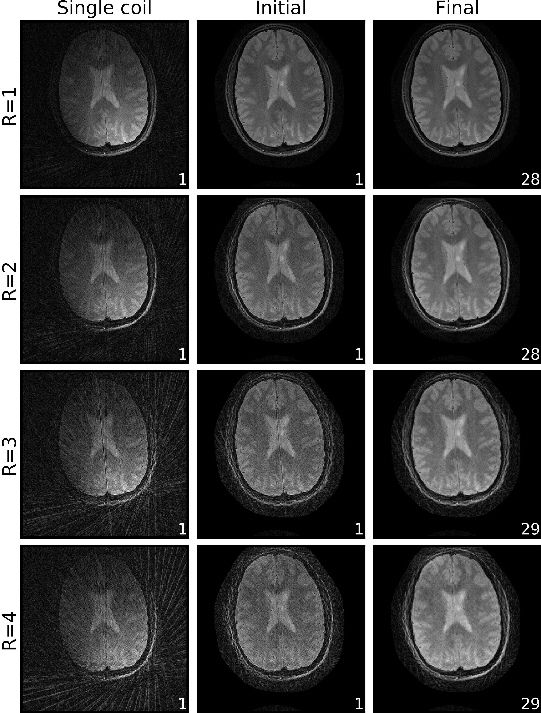
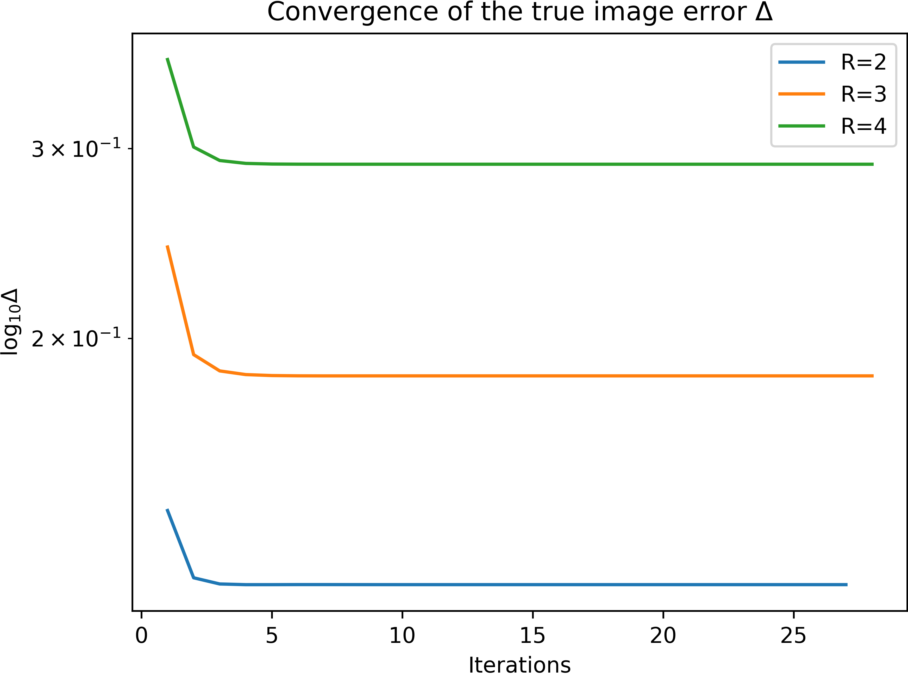
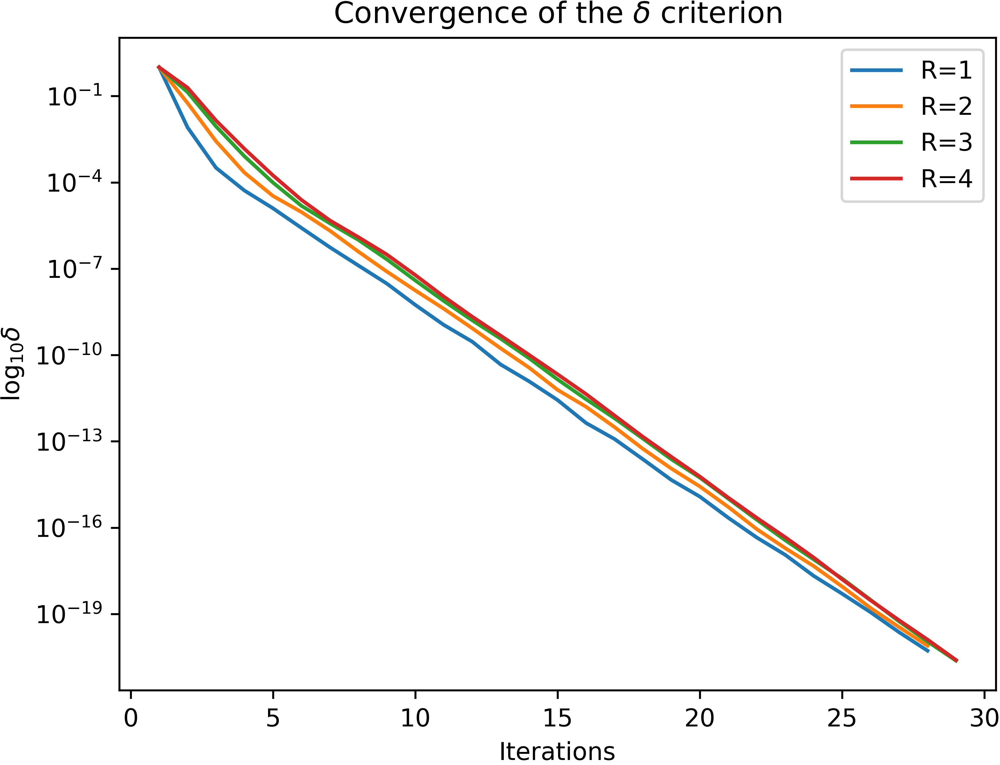
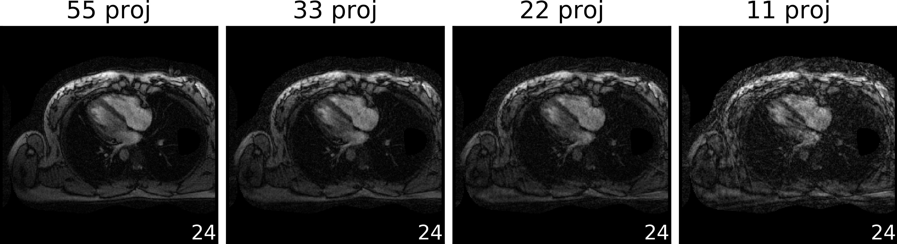

ISMRM Reproducible Research Study Group (RRSG) 2019
===================================================

This repository contains the code submission for the [RRSG 2019 challenge](https://blog.ismrm.org/2019/04/02/ismrm-reproducible-research-study-group-2019-reproduce-a-seminal-paper-initiative/) to reproduce the results in

Pruessmann, K. P., Weiger, M. , Börnert, P. and Boesiger, P. (2001), [Advances in sensitivity encoding with arbitrary k‐space trajectories](https://onlinelibrary.wiley.com/doi/full/10.1002/mrm.1241). Magn. Reson. Med., 46: 638-651.

Requirements
------------
- [Primal-Dual-Toolbox](https://github.com/VLOGroup/primal-dual-toolbox) built with [gpuNUFFT](https://github.com/andyschwarzl/gpuNUFFT).
- [BART toolbox](https://github.com/mrirecon/bart)
- [medutils](https://github.com/khammernik/medutils.git)
- python3 (Anaconda)

To install the Primal-Dual-Toolbox with gpuNUFFT and the BART toolbox, please
follow the instructions on the corresponding github pages.
The medutils package can be installed as follows.
~~~
 pip install git+https://github.com/khammernik/medutils.git
~~~
The code was tested on Ubuntu 16.04, Cuda 9.2 and a python3 anaconda environment.

Reconstruction
--------------
The challenge [dataset](http://wwwuser.gwdg.de/~muecker1/rrsg_challenge.zip) contains radial brain and heart data, which will be downloaded automatically when the script is executed.
The non-uniform Fourier transform is computed using the [gpuNUFFT](ttps://github.com/andyschwarzl/gpuNUFFT).
The [Primal-Dual-Toolbox](https://github.com/VLOGroup/primal-dual-toolbox) provides an interface to connect the gpuNUFFT with python.
Coil sensitivity maps are estimated using the [BART toolbox](https://github.com/mrirecon/bart) toolbox.
The CG SENSE optimizer is implemented in the [medutils](https://github.com/khammernik/medutils.git) package.

To perform the required
tasks run
~~~
./run_recon.sh
~~~
which will generate subfolders containing the reconstructions as h5 file and additional plots.
The required figures for the challenge are saved to the root folder.

Results
-------

**Figure 1:** Brain reconstructions for the acceleration factors R 1, 2, 3 and 4.

**Figure 2:** Convergence of the true image error for the brain data

**Figure 3:** Convergence of the tolerance for the brain data

**Figure 4:** Heart reconstructions for a different number of projections (55, 33, 22, 11).

Contact
-------
[Kerstin Hammernik](https://www.tugraz.at/institutes/icg/research/team-pock/team/hammernik/) 
Institute of Computer Graphics and Vision, 
Graz University of Technology 
<hammernik@icg.tugraz.at>
